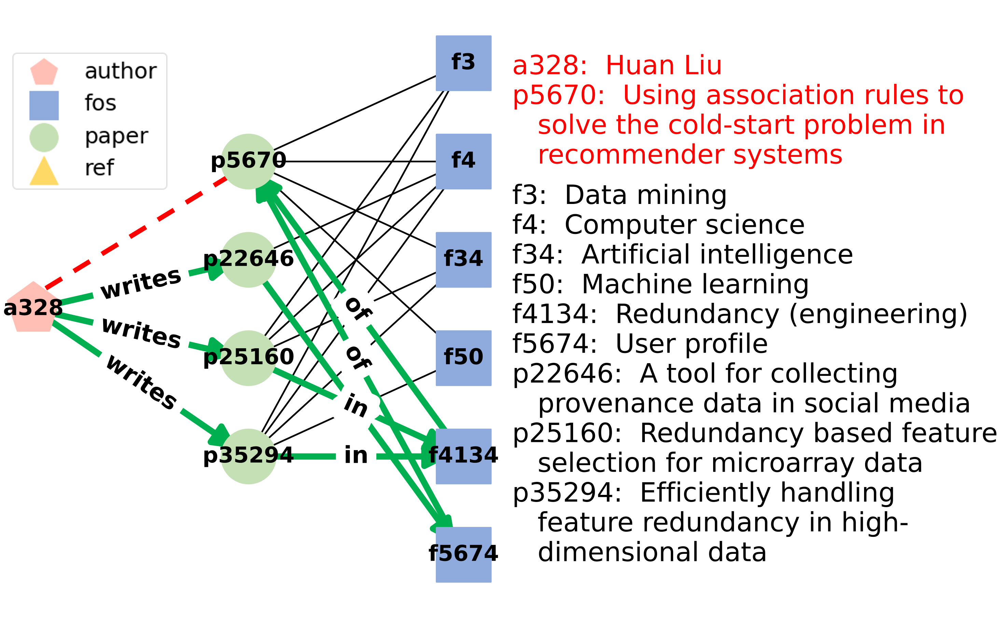

<!-- #region -->
# <ins>P</ins>ath-based <ins>G</ins>raph Neural Network <ins>E</ins>xplanation for Heterogeneous <ins>Link</ins> Prediction (PaGE-Link)


Code for the WWW2023 paper [PaGE-Link: Path-based Graph Neural Network Explanation for
Heterogeneous Link Prediction](https://arxiv.org/pdf/2302.12465.pdf) by [Shichang Zhang](https://shichangzh.github.io/), [Jiani Zhang](https://scholar.google.com/citations?user=CBmDAOEAAAAJ&hl=en), [Xiang Song](https://scholar.google.com/citations?user=LyPpCKwAAAAJ&hl=en), [Soji Adeshina](https://sojiadeshina.com/about/), [Da Zheng](https://zheng-da.github.io/), [Christos Faloutsos](http://www.cs.cmu.edu/~christos/)
, and [Yizhou Sun](http://web.cs.ucla.edu/~yzsun/).


## Getting Started

### Requirements
- Please follow the links below to install PyTorch and DGL with proper CUDA versions
    - PyTorch https://pytorch.org/
    - DGL https://www.dgl.ai/pages/start.html

- Then install packages by running the line below
```bash
pip install -r requirements.txt
```

- Our code has been tested with
    - Python = 3.10.6
    - PyTorch = 1.12.1
    - DGL = 0.9.1


### Datasets
To citation dataset used in the paper is under `datasets/`. The dataset is after augmentaion, so edges of type `likes` have been added. Similarly for the synthetic dataset. For details of the datasets, please refer to the paper. 

You may also add your favourite datasets by modifying the `load_dataset` function in `dataset_processing.py`.

### GNN Model
We implement the `RGCN` model on heterogeneous graph in `model.py`. A pre-trained model checkpoint is stored in `saved_models/`.


### Explainer Usage
- Run PaGE-Link to explain trained GNN models 
  - A simple example is shown below
  ```bash
    python pagelink.py --dataset_name=aug_citation --save_explanation
  ```

  - Hyperparameters maybe specified in the `.yaml` file and pass to the script using the `--config_path` argument.
  ```bash
    python pagelink.py --dataset_name=synthetic --config_path=config.yaml --save_explanation
  ```

- Train new GNNs for explanation
  - Run `train_linkpred.py` as the examples below
    ```bash
    python train_linkpred.py --dataset_name=aug_citation --save_model --emb_dim=128 --hidden_dim=128 --out_dim=128
    ```

    ```bash
    python train_linkpred.py --dataset_name=synthetic --save_model --emb_dim=64 --hidden_dim=64 --out_dim=64
    ```

- Run baselines 
    - A simple example is shown below, replace `method` with `gnnexplainer-link` or `pgexplainer-link`.
    ```bash
    python baselines/{method}.py --dataset_name=aug_citation
    ```


## Results

### Quantitative
- Evaluate saved PaGE-Link explanations
```bash
python eval_explanations.py --dataset_name=synthetic --emb_dim=64 --hidden_dim=64 --out_dim=64 --eval_explainer_names=pagelink
```

**Note**: As exact reproducibility is not guaranteed with PyTorch even with identical random seed
(See https://pytorch.org/docs/stable/notes/randomness.html), the results may be slightly off from the paper.

### Qualitative
Example of path explanations output by PaGE-Link. Node information are showing on the right.
Top three paths (<span style="color:green">green arrows</span>) selected by PaGE-Link for explaining the predicted link (𝑎328, 𝑝5670) (<span style="color:red">dashed red</span>). The selected paths are short and do not go through a generic field of study like “Computer Science”.

<p align="center">
  <br />
  
  <br />
</p>

Please refer to `plotting_example.ipynb` for an example of generating plots like this.

## Cite

Please cite our paper if you find this code is useful. Thank you.

```
@inproceedings{zhang2023page,
  title={PaGE-Link: Path-based graph neural network explanation for heterogeneous link prediction},
  author={Zhang, Shichang and Zhang, Jiani and Song, Xiang and Adeshina, Soji and Zheng, Da and Faloutsos, Christos and Sun, Yizhou},
  booktitle={Proceedings of the web conference 2023},
  year={2023}
}
```

## Contact Us

Please open an issue or contact shichang@cs.ucla.edu if you have any questions.


<!-- #endregion -->
